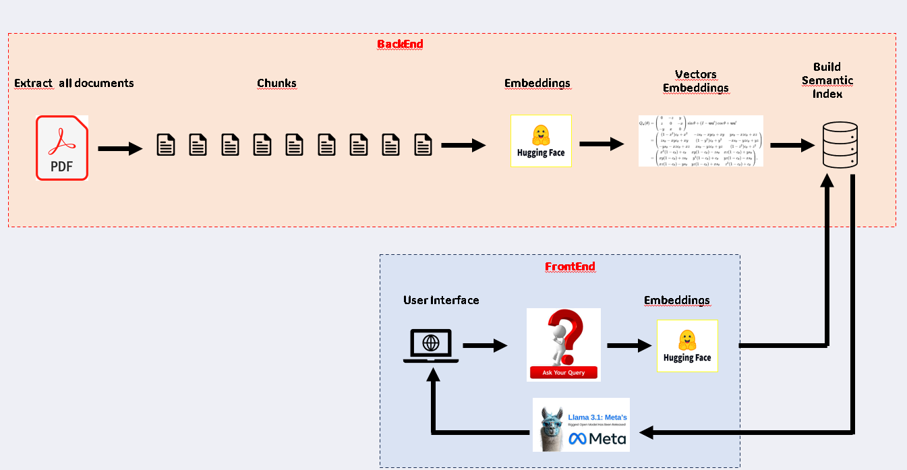

 
# Chatbot Comptable

## Définition
Un chatbot comptable est un outil automatisé qui utilise des modèles de langage avancés pour interagir avec les utilisateurs et fournir des réponses ou des informations liées à la comptabilité, notamment en analysant des fichiers PDF(Loi sur les comptables professionnels
agréés).

## Démo:

<video width="640" height="480" controls>
  <source src="video/Demo-Chatbot.mp4" type="video/mp4">
  
</video>


## Technologies Utilisées
- **Python**
- **Jupyter Notebook**
- **LangChain**
- **Pinecone**
- **Flask**
- **LLM (Modèles de Langage de Grande Taille)**
- **Hugging Face**
- **Groq**
- **PyPDF2**

## Schéma 




## Étapes à Suivre

1. **Créer un dépôt public sur GitHub** :
   - Inclure les fichiers suivants :
     - `.gitignore`
     - `README.md`
     - Licence
   - Copier le lien de ce dépôt.

2. **Créer un dossier de travail sur votre bureau** :
   ```bash
   mkdir my_project
   cd my_project

3. **Cloner le dépôt à l'intérieur de ce dossier** :
    ```bash
    git clone <lien du dépôt>

4. **Créer un environnement virtuel appelé llmops avec Python 3.10** :
    ```bash
    conda create -n llmops python=3.10 -y

5. **Activer l'environnement** :
    ```bash
    conda activate llmops

6. **Installer les bibliothèques requises** :
    ```bash
    pip install sentence-transformers==3.1.1 langchain flask pypdf python-dotenv pinecone[grpc] langchain-pinecone langchain_community langchain_groq langchain_experimental pipreqs

7. **Ouvrir le dossier de travail avec l'IDE Visual Studio Code** :
    ```bash
    code .
    ```


